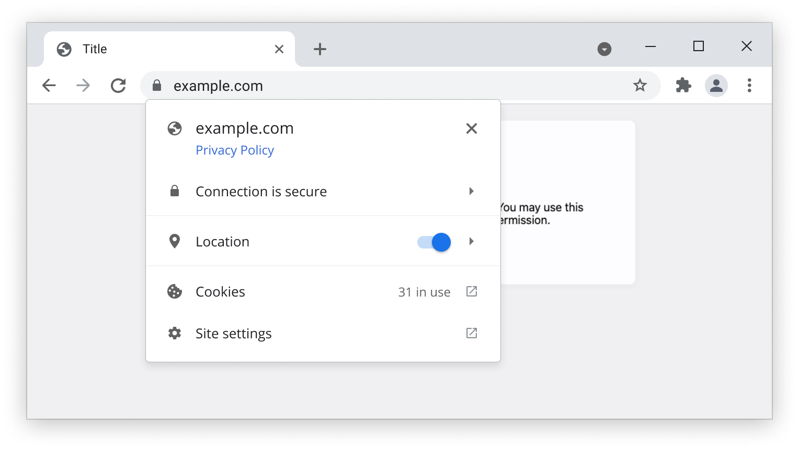

Privacy Policy Discovery
========================

TL;DR:

1.  `/.well-known/privacy-policy` should point to a site's privacy policy.
2.  Pages should annotate links that point to their privacy policy via `rel=privacy-policy`

These are sketched in more detail in <https://mikewest.github.io/privacy-policy-discovery>, and you could imagine them supporting user agent UX along the lines of this very-unreviewed-or-approved mock:

